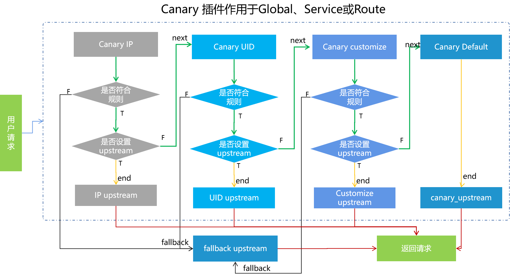
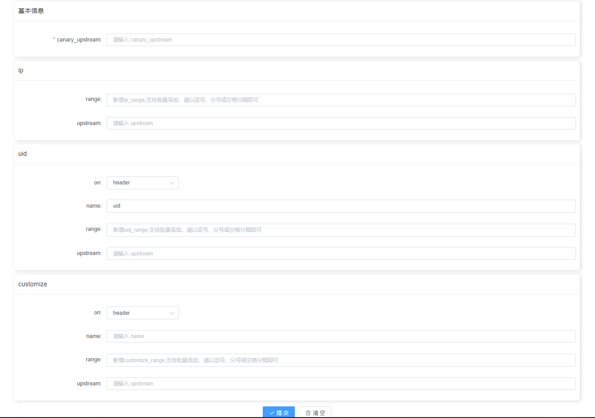

# Canary金丝雀插件[基于kong]
## 0. 概述
基于kong[基于1.2.1版本]网关灰度插件

canary插件的使用范围支持global、service、route
## 1.应用场景
- 灰度上线、版本迭代（灰度的量灵活切换）

- 特殊用户、特别版本（灰度的方式多样化）
## 2. canary插件设计原理


## 3. 安装说明

https://luarocks.org/modules/raoxiaoyan/canary
```lua
luarocks install canary
```
启用canary,在/etc/kong/kong.conf增加如下配置：
```lua
plugins = bundled,canary
```
kong restart 重启即可
## 4. canary配置界面


## 5. 配置参数说明
### 5.1 canary_upstream
canary_upstream为必填项，设置默认转发的上游代理名称，如下所示：
```text
msgbox.upstream
```
### 灰度规则1：ip
### range
设置ip支持单个，多个，范围分段IP（满足CIDR notation规则），以下值都为合法
```text
10.0.2.2 
10.0.5.0/2
```
### upstream
非必填项，设置符合ip灰度规则时，转发的上游代理名称

## 灰度规则2：uid
### on
uid的参数从哪里获取；参数所处位置可选为：

header：请求头中获取uid参数 

cookie：从cookie中获取uid参数

args：从请求参数中获取uid参数

### name
uid在请求中的参数名
### range
设置uid的匹配规则，支持单个，多个，正则匹配（前缀、后缀等）
```text
1234
^UID%d+$ //匹配前缀
```
### upstream
非必填项，设置符合uid灰度规则时，转发的上游代理名称
## 灰度规则3：customize
自定义规则
### on
自定义的参数从哪里获取；参数所处位置可选为：

header：请求头中获取uid参数

cookie：从cookie中获取uid参数

args：从请求参数中获取uid参数

### name
请求中的参数名，例如：region(地域)
### range
设置匹配规则，支持单个，多个，正则匹配（前缀、后缀等）
```text
SD001
^BJ%d+$ //匹配前缀
```
### upstream
非必填项，设置符合该灰度规则时，转发的上游代理名称

## 规则优先级
默认情况下，未设置任何灰度规则时，默认灰度规则生效

优先级如下：

ip > uid > customize > default


